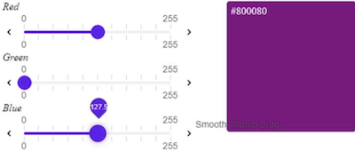
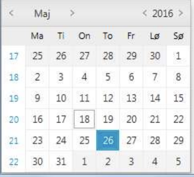

# Emporio Assignment ReadMe

#### What is the difference between an implicit and explicit wait? What would be the best choice to be used and why?
- Implicit Wait: In this type of wait, the webDriver waits for a fixed amount of time before throwing `NoSuchelementException`.
Implicit wait accepts 2 parameters, viz, timeout as an integer value and the unit of the timeout(for example: seconds, minutes, etc.).
Implicit wait is applied to all the elements of the scripts once declared.
- Explicit Wait: In this type of wait, the webDriver waits for certain condition or the maximum amount of time before throwing `ElementNotVisibleException`
We can use different type of conditions with explicit waits which are defined in class `ExpectedConditions`.
With explicit wait, we have to define condition for every element
- Best choice: Implicit wait is easy to implement but is not ideal for every circumstance.
For ex: dynamic loading of some content which may or may not take more time than what is defined in implicit waits.
Hence, explicit wait is preferred for predictable results

#### How do you handle reactjs wait, ajax wait, JavaScript loads since modern web technologies load pages partially and on demand?
- We can use explicit wait to handle ajax calls since explicit wait can wait until the expected condition on ajax response is satisfied.
- For reactJS, we can use explicit wait's wait.until and have a script condition to be used with that wait.
- For Javascript, we can use wait.until functionality of explicit waits and wait until document.readyState is completed 

#### Consider writing a framework to automate a large project, how would you proceed? What tools and technologies would you choose? How would you organize the folders?
1. First we need to identify required components for the project. This will be based on the requirements and other systems.
For ex: integration with test management will be one component, api client will be another(which can be used for setup, teardown and other verification purposes), test data will be another component as well
2. Tool choice will be depend on factors like: project requirements(like if the application to test is web only or mobile only), team's coding strength, BDD support needed or not, community support for queries and fixes.
Assuming our requirement is for Web automation, we can choose Selenium for automation. Selenium supports multiple language clients so it would be easy for the team to contribute and also Selenium has wide community support.
Assuming team has fair bit on knowledge on Java, I'll choose Java as a technology for the project
3. Folder Structure:
```
emporio-functional-tests
    |config
     ---|staging
     ---|production
     |data
          ---|staging
          ---|production
    |src
     ---|main
        ---|java
            ---|driver
            ---|page
            ---|constant
            ---|backend
            ---|assertion
            ---|wait
            ---|util
     ---|test
        ---|java
            ---|constant
            ---|backend
            ---|wait
            ---|util
            ---|functional
        ---|resources
                |properties
    |screenshots
    
- src/main will hold the core functinal logic & required utilities for the automation suite.
For ex: Page objects, web driver classes and initialisation, assertion clases for pages, backend apis, extra utilities, constants, custom wait and exceptions
- src/test will hold all the testing related classes for the suite like unit tests for utilities & assertions, unit & integration tests for apis and lastly functional UI tests
This folder will have resources folder which will include properties file for logs, maven and test data
- config folder will hold details for an environment based on parameter. Like property file for staging environment will tell tests to use what api hostname while testing.
By this way, tests can be scaled to any new environment at any point of time even for local verification
- data folder will hold data 
- screenshots can have images for different page objects on differrnt browser/mobile platforms. 
    
``` 

#### Consider you have a slider in the application like below? How would you ensure the slider can be moved to specific point?


There are a few approaches depending on the implementation of the web page which are defined below:

- If there is an attribute which represents the value of the slider position, then that attribute can be used.
- Suppose slider position is represented in percentage, then based on the percentage value, min value & max value the exact value of the slider can be identified.
- Another way is to validate based on the values of the element style. We can use fields like left, right, etc depending on the orientation.

#### A web application has an ‘upload button’ that is to upload a file to the server, how do we upload the file with only using the selenium tool?
- <strong>Problem with File Upload</strong>: When upload button is clicked, OS window is opened to select the file. But Selenium does not have any control on such windows as they're not the part of the DOM.
And also Selenium cannot dismiss this window, hence the tests stuck
- <strong>Solution</strong>: Use send_keys function on the input element which is attached to the uploader. Absolute path of the file needs to be passed as an argument.
If this input field is hidden, then we need to run some JavaScript code to make that field visible.

#### How do you create a driver and use it as a common entity across pageobjects and helpers without passing it as constructor argument?
This can be done by defining a BasePage class with protected static variable `driver` and initialise it in the parent class itself. Then all the Page Objects being inherited from the BasePage class will share the same reference of webdriver.


#### How do you handle driver initialization for parallel test run?
Selenium webDriver is attached to a particular port where test client execute the calls and server listens for the calls.
We can have different instances of driver attached to different ports so that multiple driver can be accessed in parallel.
There are multiple ways how these port numbers can be served. For ex: it can be hardcoded or can be read from a separate properties file.

#### Without using a selenium function, how do you select a date to ensure it falls in current month? As seen below the datepicker has few days in past and few in present?

- We can use current system time to get current month & year, which can tell number of days in that corresponding month.
- Once we know `start` & `end` of that month, we can look for first position of `start` and last position of the `end`. For ex: say current month in May and it has 31 days. We'll look for position of first 1 and last 31
- Based on these positions and datepicker dimensions, we can select a date by performing some mathematical calculation which falls in the current month.

#### Coding Assessment:
     - View bestbuy.com website and try the following steps manually.
     - Open Bestbuy.com site on your browser.
     - Search for any product keyword
     - Filter any product
     - Select a product that is available online
     - Add the product to the cart
     - Open the shopping bag
     - Choose to continue as a guest user
     - Specify invalid address and payment info
     - Submit order  Check if correct errors are displayed.
     When you are with the above, we'd like you to:
     - Write a few lines about what your approach to was testing the application.
     - Provide us with the test cases (scenarios) you created.
     Complete a small quality analysis and testing exercise, where an end to end test of
     the above user actions needs to be automated with Selenium Webdriver.
     Please provide us with readmes on how to execute the code, It should include
     working code for executable tests.
     
 Approach towards testing:
 - I carried out the above mentioned steps with few search strings.
 - Then figured out that there can be combination of either Pickup or delivery. But for a certain kind of products, there will be no option from them, like gift cards.

Test Scenarios: Some of the test scenarios that I tested

- Search for a product and verify brand filter can be applied

```
1. Search for product with a keyword
2. Apply brand filter to the search results
3. Verify filter is applied successfully.
```

- Verify product can be added to cart from Search Results Page
```
1. Search for product with a keyword
2. Tap on Add to cart button from Search results page
3. Verify the product is added to the cart
```

- Verify product can be added to cart from Product Details Page
```
1. Search for product with a keyword
2. Select product on Search results page
3. Verify Product detail page is shown
4. Tap on Add to cart button on Product Details page
5. Verify the product is added to the cart
```

- Verify pagination on Search results page
```
1. Search for product with a keyword
2. Verify first page of products returned
3. Tap on next page and verify different set of products are shown
4. Tap on intermediate page and verify different set of products are shown
```

- Verify pagination works with arrows on Search results page
```
1. Search for product with a keyword
2. Verify first page of products returned
3. Tap on right arrow and verify next page is shown
4. Tap on left arrow and verify previous page is shown
```

- Verify sort methods on search results page
```
1. Search for product with a keyword
2. Tap on Sort By drop down and select order by name
3. Verify the sorting of products is correct
```

Coding assignment:
Setup Instructions:
- Clone the repo
- Download ChromeDriver from here and unzip it.

Steps To Run Test:
- Go to project folder
- Navigate to emporiofunctionaltest; `cd emporiofunctionaltest`
- Execute test with

`mvn clean install -Dchrome.driver.path="</path/tochromedriver>"`

Note:
- For detailed execution logs, please refer to logs/build.log file